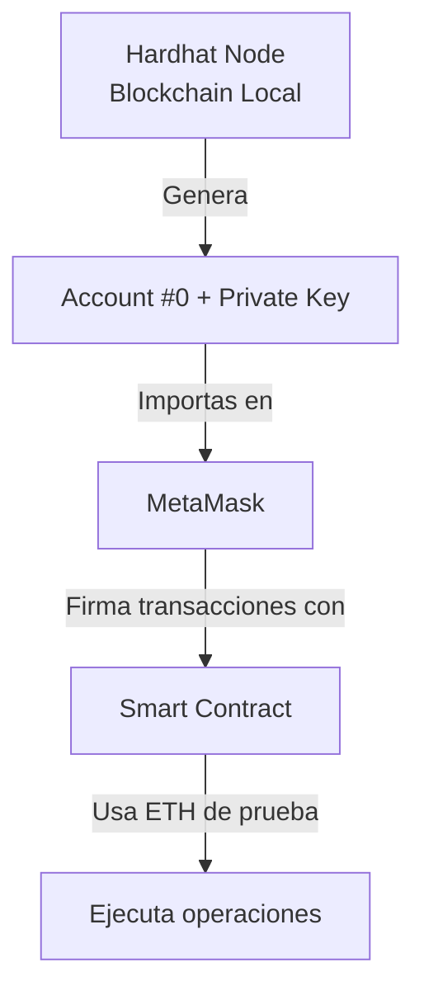

# Blockchain


# Conceptos

## Bloques

Un bloque es una estructura de datos que almacena información.

Cada bloque contiene:


 
Campo | Significado
-- | --
Index | La posición del bloque en la cadena.
Timestamp | Cuándo se creó el bloque.
Data | Información que se quiere registrar (ej. transacciones).
Hash | Huella digital única del bloque.
PreviousHash | Hash del bloque anterior (une los bloques).
Nonce | Número que se ajusta para lograr el hash correcto durante la minería.

 
La clave:

El bloque apunta al bloque anterior usando PreviousHash.

Esto crea una cadena inmutable: si cambia 1 solo dato, el hash cambia ? rompe la cadena ? se detecta manipulación.


## Hashing (SHA-256)

Un hash es una función que convierte datos en una secuencia única de caracteres (ej. 64 hexadecimales).

Características:

- Determinístico: la misma entrada produce el mismo hash.
- No reversible: no puedes obtener el texto original.
- Pequeños cambios ? hash totalmente diferente.

En blockchain:

- Se usa el hash para garantizar integridad.
- Si alguien altera un bloque, el hash cambia ? la blockchain detecta manipulación.


## Proof of Work (PoW) — Prueba de Trabajo

PoW asegura que crear un bloque cueste un esfuerzo computacional.

Cómo funciona:

- Para que un bloque sea válido, su hash debe comenzar con ciertos ceros (dificultad).
- Para lograrlo, el sistema prueba distintos valores de Nonce hasta encontrar uno que genere un hash con el patrón deseado.


## Nodos

Un nodo es una computadora que:

- Guardan una copia completa de la blockchain.
- Validan los bloques.
- Se sincronizan entre sí.

Red descentralizada ? no hay servidor central.


## Consenso (Versión Simplificada)

Como cada nodo guarda la cadena, debe haber una regla para decidir cuál cadena es la “real”.

Regla más simple:

- La cadena válida es la más larga (más trabajo acumulado).

Si dos nodos tienen versiones distintas:

-  Se compara.
- Se conserva la más larga.
- La otra se reemplaza.

Esto evita falsificaciones.


# Ethereum 


## ETH

ETH (Ether) es la criptomoneda nativa de la blockchain Ethereum y el combustible que hace funcionar toda su red. No es solo "dinero digital", sino el recurso computacional necesario para ejecutar cualquier operación en Ethereum.

Pagar por Transacciones (Gas Fees)
- Cada operación en Ethereum consume gas (unidades de computación), y ese gas se paga en ETH.


ETH es el recurso computacional que convierte código Solidity en acción real en la blockchain, pagando a quienes mantienen la red descentralizada.


# contrato inteligente (smart contract)


Un contrato inteligente (smart contract) en blockchain es un programa informático o código almacenado y ejecutado en una cadena de bloques (como Ethereum) que se autoejecuta cuando se cumplen una serie de condiciones predefinidas.

Funcionan siguiendo la lógica simple de "si/cuando... entonces..." (if/when... then...), lo que permite automatizar transacciones y acuerdos sin necesidad de intermediarios (como bancos, abogados o notarios).


Beneficios Principales

Los contratos inteligentes ofrecen varias ventajas sobre los contratos tradicionales en papel:

- Eficiencia: La automatización acelera el proceso de verificación y ejecución, haciendo las transacciones más rápidas.
- Ahorro de Costes: Eliminan o reducen la necesidad de intermediarios, lo que disminuye los gastos asociados.
- Confianza: No se requiere una relación de confianza previa entre las partes, ya que la ejecución está garantizada por el código y la seguridad de la blockchain.
- Precisión: Al ser código, eliminan los errores humanos y las ambigüedades en la interpretación de los términos.


# Desarrollo

## Solidity


Solidity es el lenguaje de programación más usado para escribir Smart Contracts en Ethereum y redes compatibles (Polygon, Avalanche, BNB Chain, etc.).

Es:

- Similar a JavaScript en su sintaxis.
- Compilado para la Ethereum Virtual Machine (EVM).
- Tipado estático.


## Remix IDE


Remix IDE is used for the entire journey of smart contract development by users at every knowledge level. It requires no setup, fosters a fast development cycle, and has a rich set of plugins with intuitive GUIs. The IDE comes in two flavors (web app or desktop app).


## Hardhat

Hardhat es un entorno de desarrollo profesional para smart contracts de Ethereum que permite compilar, desplegar, probar y depurar contratos inteligentes de forma local antes de subirlos a la blockchain real. Está construido por la Nomic Foundation y es uno de los frameworks más populares en el ecosistema Ethereum


Cuando ejecutas npx hardhat node, Hardhat genera automáticamente 10 cuentas Ethereum de prueba con saldos de 10,000 ETH ficticios cada una. Estos valores son solo para desarrollo local y no tienen valor real.


Account #0: La Identidad Digital Simulada

Concepto

Es una dirección Ethereum (clave pública derivada) que representa un usuario simulado en tu blockchain local. En Ethereum real, esto sería como tu "número de cuenta" o "CBU" público.

Ejemplo:

```
Account #0: 0xf39Fd6e51aad88F6F4ce6aB8827279cffFb92266
```

- Formato: Empieza con 0x + 40 caracteres hexadecimales (20 bytes)
- Propósito: Recibir ETH, enviar transacciones, interactuar con contratos
- Característica: En Hardhat, ya viene prefinanciada con 10,000 ETH de prueba para que puedas hacer transacciones sin comprar ETH rea

Private Key: La Contraseña Maestra

Concepto Criptográfico

Es una clave secreta única de 256 bits que demuestra que eres el dueño de la Account #0. Es matemáticamente imposible de adivinar (hay más combinaciones que átomos en el universo).
Ejemplo:

```
Private Key: 0xac0974bec39a17e36ba4a6b4d238ff944bacb478cbed5efcae784d7bf4f2ff80
```


	
	
**Hardhat Ignition**	
	
Hardhat Ignition es un sistema declarativo para desplegar smart contracts en Ethereum y redes compatibles (como Rootstock, Sepolia, etc.). Fue desarrollado por la Nomic Foundation como el sistema oficial de despliegue para Hardhat, reemplazando a hardhat-deploy y ofreciendo una experiencia más robusta y automatizada

	
## 	Dune
	
Dune es una plataforma web utilizada para consultar, analizar y visualizar datos on-chain (datos que están en la blockchain). Es muy popular en el ecosistema Ethereum y redes compatibles (Polygon, Optimism, Arbitrum, BNB Chain, etc.).


## Sepolia

Sepolia es una red de pruebas (testnet) de Ethereum, diseñada para que los desarrolladores puedan probar contratos inteligentes y aplicaciones sin gastar dinero real.


# web3


# Explorar 


## Dune

Dune.com (o simplemente Dune) es una plataforma web utilizada para consultar, analizar y visualizar datos on-chain (datos que están en la blockchain).
Es muy popular en el ecosistema Ethereum y redes compatibles (Polygon, Optimism, Arbitrum, BNB Chain, etc.).

¿Qué hace Dune?

- Dune toma los datos públicos de las blockchains (transacciones, balances, contratos, logs de eventos, etc.) y los convierte en tablas SQL.
Sobre esas tablas, los usuarios pueden:
- Escribir consultas en SQL
- Construir dashboards y gráficos
- Compartir análisis con la comunidad


# IPFS

IPFS (InterPlanetary File System) es un protocolo distribuido para almacenar y compartir archivos de forma descentralizada, utilizando un modelo peer-to-peer.


En esencia, IPFS busca cambiar la forma en que se accede a la información en Internet, pasando de la tradicional dirección por ubicación (usando URLs HTTP que apuntan a un servidor centralizado) a la dirección por contenido.


IPFS funciona distribuyendo bloques de un archivo a través de múltiples nodos en su red, lo que ofrece varias ventajas:

- Descentralización: Los archivos no se almacenan en un único servidor, eliminando el punto único de falla y haciendo que la red sea más resistente a la censura o a las interrupciones del servidor.

- Identificación de Contenido (Content Addressing): En lugar de una URL, cada archivo y cada bloque de datos se identifica mediante un hash criptográfico único llamado CID (Content Identifier). Si el contenido del archivo cambia, el CID también cambia. Esto garantiza la integridad y la inmutabilidad del contenido.

- Eficiencia: Cuando un usuario solicita un archivo, IPFS lo recupera de los nodos más cercanos que tienen esas partes, lo que puede mejorar la velocidad y reducir la latencia.


La Solución con IPFS
En lugar de almacenar el archivo completo en la blockchain, se utiliza IPFS para el almacenamiento. El proceso es:

- El archivo se carga en la red IPFS.
- IPFS genera un CID (el hash único) para ese archivo.
- Solo el CID del archivo se almacena en la blockchain (por ejemplo, dentro de un Contrato Inteligente o como metadatos de un NFT).

Al guardar solo el CID en la blockchain, se logra:

- Escalabilidad: Se reduce drásticamente la cantidad de datos que la blockchain necesita manejar.
- Inmutabilidad y Verificación: El CID almacenado en la blockchain sirve como una prueba irrefutable de que el archivo con ese contenido exacto existe en IPFS. Si alguien intenta manipular el archivo, el CID cambiaría, lo que invalidaría el enlace registrado en la blockchain.
