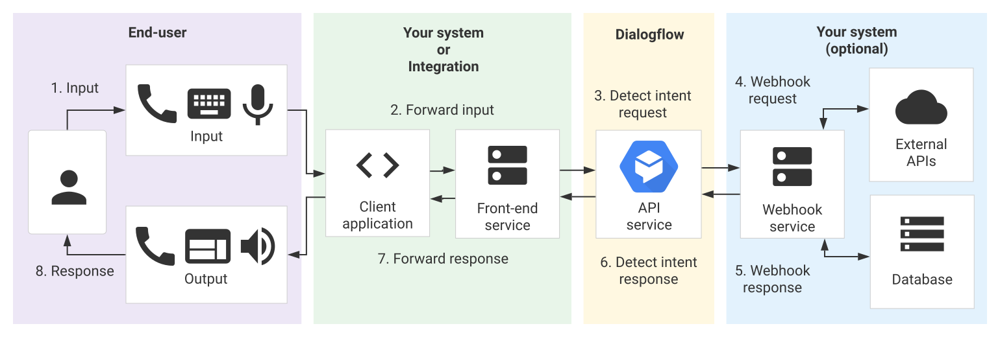

# chatbot

Un chatbot es un software que le permite automatizar conversaciones con sus clientes. Puede usarse para responder preguntas frecuentes, recopilar clientes potenciales y más.

# Dialogflow

Plataforma de NLU/NLP de Google para crear chatbots con comprensión del lenguaje natural avanzada.

 Ventajas:

- Excelente NLU (basado en modelos de IA de Google).
- Integración nativa con Google Assistant, Google Cloud, Contact Center AI.
- Interfaz visual de diseño de intents y entidades.
- Soporte multilenguaje robusto.
- Integración fácil con apps web, apps móviles, y servicios de Google.
- Versiones Standard y CX (para flujos complejos).

Desventajas:
- Limitado en personalización de lógica fuera de Google.
- Costos pueden dispararse con alto volumen.
- Menos control si se quiere autohospedar (no es open-source).
- Menos adecuado para integraciones no-Google.

Precios:
- Standard Edition (gratuita): hasta 180 requests/min y 100K intents/mes.
- CX Edition: desde $0.002 por request (entrada/salida).
- Costos por detectIntent, streaming, etc.
- Puede volverse costoso con tráfico alto.

Arquitectura:
- SaaS completamente gestionado por Google Cloud.
- No autohospedable.
- API basada en REST/gRPC.
- Arquitectura basada en intents, entities, contexts y fulfillment (webhooks).
- CX permite flujos de diálogo más complejos (state machines).

Casos de uso:
- Asistentes virtuales con comprensión de lenguaje natural.
- Integración con Google Assistant (smart speakers, apps).
- Centros de contacto automatizados (con CCAI).
- Bots con alta necesidad de entendimiento semántico.

## Dialogflow CX

Dialogflow CX es una plataforma avanzada de Google Cloud para crear agentes conversacionales (chatbots y asistentes virtuales). 

Conceptos Fundamentales

- Agent (Agente): Es el chatbot completo que contiene toda la lógica conversacional. Representa la aplicación de IA conversacional que interactúa con los usuarios.
- Flow (Flujo): Define el camino conversacional que puede tomar una conversación. Un agente puede tener múltiples flujos para manejar diferentes temas o procesos de negocio. Por ejemplo, un flujo para "hacer pedidos" y otro para "soporte técnico".
- Page (Página): Son los estados individuales dentro de un flujo donde ocurre la conversación. Cada página puede capturar información específica del usuario, proporcionar respuestas y decidir hacia dónde dirigir la conversación.
- Intent (Intención): Representa lo que el usuario quiere hacer o comunicar. Por ejemplo, "quiero hacer un pedido", "necesito ayuda" o "cancelar cita". Los intents se entrenan con frases de ejemplo.
Elementos de Procesamiento
- Entity Types (Tipos de Entidad): Definen y extraen información específica de las conversaciones del usuario, como fechas, números, nombres de productos, etc. Pueden ser del sistema (preconfiguradas) o personalizadas.
- Parameters (Parámetros): Almacenan los valores extraídos de las entidades durante la conversación. Por ejemplo, si el usuario dice "reserva para el viernes", el parámetro "fecha" almacenaría ese valor.
- Session (Sesión): Mantiene el contexto de una conversación individual con un usuario específico, preservando parámetros y estado a lo largo de múltiples intercambios.

Respuestas y Acciones

-  Fulfillment (Cumplimiento): Permite conectar el agente con servicios externos (APIs, bases de datos) para procesar solicitudes complejas o realizar acciones específicas como procesar pagos o consultar inventarios.
- Webhooks: Endpoints HTTP que reciben información del agente y pueden devolver respuestas dinámicas o ejecutar lógica de negocio externa.
Elementos de Control
- Conditions (Condiciones): Lógica que determina el flujo de la conversación basada en parámetros, respuestas del usuario o datos externos.
- Event Handlers (Manejadores de Eventos): Responden a eventos específicos como timeouts, errores de reconocimiento de voz, o eventos personalizados.
- Transition Routes (Rutas de Transición): Definen cómo navegar entre páginas basándose en intents, condiciones o eventos específicos.

Características Avanzadas

-  Training Phrases (Frases de Entrenamiento): Ejemplos de lo que los usuarios podrían decir para activar un intent específico, permitiendo que el modelo de NLU aprenda variaciones naturales del lenguaje.
- System Functions: Funciones predefinidas para tareas comunes como formateo de texto, manipulación de fechas, o operaciones matemáticas básicas.
- Version Control: Permite gestionar diferentes versiones del agente para desarrollo, pruebas y producción.

La arquitectura de Dialogflow CX está diseñada para manejar conversaciones complejas y de múltiples turnos, ofreciendo mayor control y flexibilidad que las versiones anteriores de Dialogflow ES (Essentials).

# Botpress

- Ventajas: Interface visual + código, open source, flujos conversacionales claros
- Casos de uso: Empresas que necesitan personalización pero quieren rapidez de desarrollo
- Ideal para: Trámites con múltiples pasos, escalación a humanos

Botpress — The open-source Virtual Assistant platform

Plataforma de código abierto (open-source) para crear chatbots con una interfaz visual intuitiva. Se enfoca en la facilidad de uso y la personalización.

Ventajas:
- Open-source (versión Community gratuita).
- Arquitectura modular y extensible (módulos, integraciones, plugins).
- Interfaz visual de diseño de flujos (drag & drop).
- Autohospedaje (on-premise) posible.
- Soporte para NLU integrado (basado en Transformers).
- Integración con múltiples canales: WhatsApp, Telegram, Webchat, etc.
- Ideal para equipos técnicos que quieren control total.

Desventajas:
- La versión gratuita tiene limitaciones en soporte y funcionalidades avanzadas.
- Curva de aprendizaje moderada para personalización avanzada.
- Rendimiento puede decaer con bots muy complejos sin optimización.

Precios:
- Community (gratuita): Autohospedada, código abierto.
- Cloud (SaaS): Desde $49/mes (hasta 100K mensajes/mes).
- Enterprise: Precio personalizado (on-premise + soporte avanzado).

Arquitectura:
- Basada en Node.js.
- Frontend en React.
- Base de datos: PostgreSQL o SQLite.
- Autohospedable o en la nube.
- Arquitectura modular: se pueden añadir módulos personalizados.

Casos de uso:
- Chatbots internos para empresas.
- Servicio al cliente automatizado (SAC).
- Automatización de procesos internos.
- Proyectos con necesidad de privacidad de datos (por autohospedaje).

https://github.com/botpress/botpress

# Microsoft Bot Framework 

Plataforma completa de Microsoft para crear, desplegar y gestionar bots. Parte del ecosistema Azure.

Ventajas:
- Integración profunda con Azure y servicios de Microsoft (Teams, Power Platform).
- SDKs en múltiples lenguajes (C#, JavaScript, Python).
- Bot Framework Composer: herramienta visual para diseñar conversaciones.
- Escalabilidad en la nube con Azure.
- Excelente soporte para bots en Microsoft Teams.
- Conector universal para múltiples canales (Slack, Facebook, Telegram, etc.).

Desventajas:
- Complejidad técnica mayor (requiere conocimientos de desarrollo).
- Costos pueden escalar rápido en Azure (especialmente si se usan servicios adicionales como LUIS, QnA Maker, etc.).
- Menos intuitivo para usuarios no técnicos.
- Dependencia del ecosistema Microsoft.

Precios:
- Framework en sí es gratuito (SDKs, Composer).
- Costos asociados a Azure:
- Bot Service: gratuito hasta cierto uso.
- LUIS (NLU): desde $1 por 1K transacciones.
- App Service, Cognitive Services, etc.: costos variables.
- Total puede variar desde $0 (pequeños proyectos) hasta miles.

Arquitectura:
- Basado en servicios en la nube de Azure.
- Arquitectura basada en microservicios.
- Puede desplegarse en contenedores (Docker) o Azure App Service.
- Comunicación mediante el Bot Connector.
- Uso de LUIS para NLU o Azure Cognitive Services.

Casos de uso:
- Integración con Microsoft Teams (bots internos, productividad).
- Empresas que ya usan Azure.
- Soluciones empresariales complejas.
- Automatización con Power Automate.

- Azure Bot Service Pricing:

Free (10,000 messages/month)
S1 $0,50 per 1,000 messages (on Premium Channels)

## Bot Framework Emulator

Bot Framework Emulator being retired in favor of Agents Playground

We are in the process of archiving the Bot Framework Emulator repository on GitHub. This means that this project will no longer be updated or maintained. Customers using this tool will not be disrupted. However, the tool will no longer be supported through service tickets in the Azure portal and will not receive product updates.

We plan to archive this project no later than end of December of 2025.

## Bot Framework Composer

Bot Framework Composer is an open-source, visual authoring canvas for developers and multi-disciplinary teams to design and build conversational experiences with Language Understanding and QnA Maker, and a sophisticated composition of bot replies (Language Generation). Within this tool, you'll have everything you need to build a sophisticated conversational experience.

# Chatwoot

Plataforma open-source de atención al cliente con chatbot incluido. Más orientado a mensajería conversacional unificada que a IA pura.

Ventajas:
- Open-source y autohospedable.
- Enfocado en soporte al cliente (no solo chatbots).
- Interfaz tipo "inbox" (como Intercom o Zendesk).
- Integración con WhatsApp, Facebook, Instagram, email, etc.
- Chatbot básico con reglas (no NLU avanzado por defecto, pero puede integrarse).
- Ideal para equipos de soporte.

Desventajas:
- Capacidad de NLU limitada (requiere integrar con otras herramientas como Dialogflow o Rasa).
- Menos potente para bots con lógica conversacional compleja.
- La automatización es más básica (por reglas).
- Menos madurez en flujos de diálogo avanzados.

Precios:
- Self-hosted (gratuito): Código abierto, puedes instalarlo gratis.
- Cloud (SaaS): Desde $29/mes (hasta 10 agentes, 10K conversaciones/mes).
- Escalabilidad con planes empresariales.

Arquitectura:
- Backend en Ruby on Rails.
- Frontend en Vue.js.
- Base de datos: PostgreSQL.
- Autohospedable o en la nube.
- API RESTful y webhooks para integraciones.

Casos de uso:
- Centros de atención al cliente.
- Empresas que quieren unificar canales de comunicación.
- Chatbots simples (FAQ, rutas de conversación fijas).
- Startups que buscan una solución todo-en-uno de soporte.

## Dialogflow

How to bring your Dialogflow chatbot to Chatwoot?

https://chatwoot.help/hc/user-guide/articles/1677743452-how-to-integrate-your-dialogflow-chatbot-with-chatwoot

## Docker

https://developers.chatwoot.com/self-hosted/deployment/docker

# whaticket

Empresa peruana. Fundada por Juan Luis Auccatoma

https://whaticket.com/

# Opciones procesamiento de lenguaje natural (NLP)

| Solución | Integración | Complejidad | Idiomas | Costo |
|----------|-------------|-------------|---------|-------|
| Azure AI Language (LUIS) | ⭐⭐⭐⭐⭐ | Media | 30+ | Pago |
| Azure OpenAI | ⭐⭐⭐⭐ | Baja | Todos | Pago |
| Rasa | ⭐⭐⭐ | Alta | Muchos | Gratis |
| Wit.ai | ⭐⭐⭐ | Media | 130+ | Gratis |
| Dialogflow | ⭐⭐⭐⭐ | Media | 30+ | Freemium |
| spaCy | ⭐⭐ | Media | 20+ | Gratis |

Wit.ai es una plataforma de procesamiento de lenguaje natural (NLP) propiedad de Meta (Facebook) que permite a los desarrolladores construir aplicaciones que puedan entender el lenguaje humano. Esencialmente, es un servicio que convierte el texto o voz en datos estructurados que las aplicaciones pueden entender y actuar upon.

# Rasa 

RASA es un framework de código abierto para construir asistentes conversacionales y chatbots con inteligencia artificial. Te explico sus características principales:

Componentes principales
- Rasa NLU (Natural Language Understanding): Se encarga de entender el lenguaje natural del usuario, identificando:

Intenciones (intents): lo que el usuario quiere hacer
Entidades: información específica como nombres, fechas, lugares

- Rasa Core: Gestiona el flujo de la conversación y decide qué acciones tomar basándose en el contexto y el historial del diálogo.

Características destacadas

- Open source: El código es completamente abierto y puede ser modificado
- On-premise: Puedes instalarlo en tus propios servidores, manteniendo control total sobre los datos
Machine Learning: Utiliza modelos de aprendizaje automático para mejorar con el tiempo
- Personalizable: Permite entrenar modelos específicos para tu dominio
- Multilingüe: Soporta múltiples idiomas

Casos de uso típicos

- Chatbots de atención al cliente
- Asistentes virtuales empresariales
- Automatización de procesos mediante conversación
- Interfaces conversacionales para aplicaciones

Rasa se programa principalmente en Python y es muy popular entre desarrolladores que necesitan crear asistentes conversacionales más sofisticados que los chatbots basados en reglas simples, pero manteniendo control sobre la infraestructura y los datos

# Revisiones

https://wit.ai/

Kore.ai

Chatbots 
https://wotnot.io/

# Referencias

Chatbots: The Definitive Guide (2021)
https://www.artificial-solutions.com/chatbots

Chatbot Software — Ultimate Guide 2019 (& The Best Software!)
https://medium.com/@taylorbologni/chatbot-software-ultimate-guide-2019-the-best-software-921c664978a6