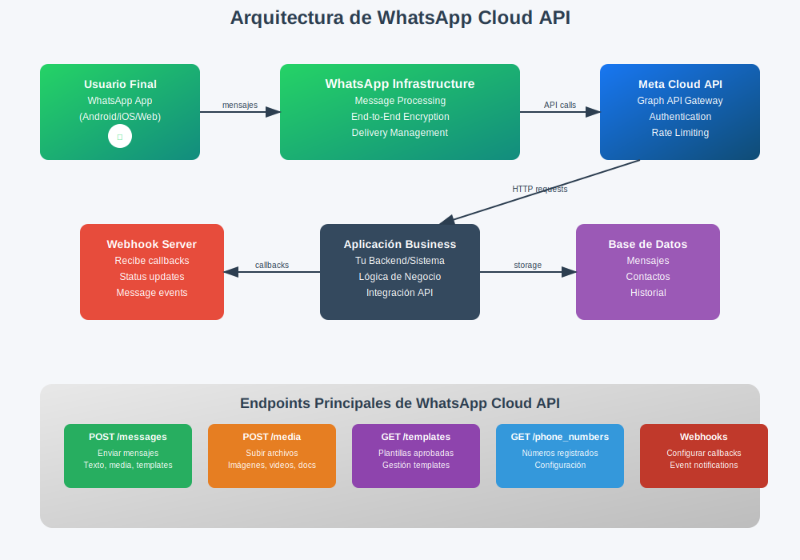

# WhatsApp Cloud API 


# Arquitectura WhatsApp Cloud API 

Componentes de la Arquitectura:

1. Usuario Final

- La aplicación de WhatsApp en dispositivos móviles o web
- Punto de origen y destino de los mensajes

2. WhatsApp Infrastructure

- Maneja el procesamiento de mensajes
- Gestiona el cifrado end-to-end
- Administra la entrega de mensajes

3. Meta Cloud API

- Gateway principal de la Graph API
- Maneja autenticación y autorización
- Implementa rate limiting y control de acceso

4. Aplicación Business

- Tu sistema backend personalizado
- Contiene la lógica de negocio específica
- Se integra con la API de WhatsApp

5. Webhook Server

- Recibe notificaciones en tiempo real
- Procesa callbacks de estado de mensajes
- Maneja eventos de mensajes entrantes

6. Base de Datos

- Almacena mensajes, contactos e historial
- Persiste datos de la aplicación

Endpoints Principales:

POST /messages: Para enviar mensajes (texto, media, templates)
POST /media: Para subir archivos multimedia
GET /templates: Para gestionar plantillas aprobadas
GET /phone_numbers: Para manejar números registrados
Webhooks: Para configurar notificaciones de eventos

El flujo típico va desde el usuario final, pasa por la infraestructura de WhatsApp, llega a Meta Cloud API, se procesa en tu aplicación business, y se almacena en la base de datos, mientras que los webhooks proporcionan notificaciones en tiempo real.




# Webhook


Cuando se produce un evento de activación, la Plataforma de WhatsApp Business ve el evento y envía una notificación a la URL de un webhook que se ha especificado previamente. Puedes recibir dos tipos de notificaciones:

- Mensajes recibidos: esta alerta te avisa cuando has recibido un mensaje. También se denominan “notificaciones entrantes” en la documentación.
- Notificaciones de precios y de estado de los mensajes: esta alerta te avisa cuando ha cambiado el estado de un mensaje (por ejemplo, el mensaje se ha leído o entregado). También se denominan “notificaciones salientes” en la documentación.


Todos los webhooks tienen el formato genérico siguiente:


```
{
  "object": "whatsapp_business_account",
  "entry": [{
      "id": "WHATSAPP_BUSINESS_ACCOUNT_ID",
      "changes": [{
          "value": {
              "messaging_product": "whatsapp",
              "metadata": {
                  "display_phone_number": "PHONE_NUMBER",
                  "phone_number_id": "PHONE_NUMBER_ID"
              },
              # specific Webhooks payload            
          },
          "field": "messages"
        }]
    }]
}
```