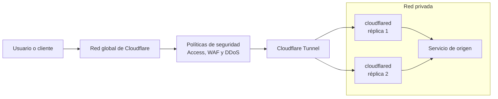

# Cloudflare Tunnel

## Introducción

Cloudflare Tunnel es un mecanismo de conexión de Cloudflare Zero Trust que permite publicar aplicaciones o conectar redes privadas sin exponer directamente el servidor de origen a Internet. Para ello utiliza `cloudflared`, un agente ligero que se ejecuta cerca del servicio y crea conexiones salientes cifradas hacia la red global de Cloudflare.

Este modelo elimina la necesidad de asignar una IP pública al origen o abrir puertos de entrada en el firewall. Las solicitudes llegan primero a Cloudflare y atraviesan el túnel únicamente después de aplicar los controles configurados en la plataforma, como DNS, protección contra ataques, políticas de acceso y reglas de seguridad.

> [!IMPORTANT]
> Cloudflare Tunnel protege la conectividad con el origen, pero no autentica usuarios por sí solo. Para controlar quién puede acceder a una aplicación se debe combinar con Cloudflare Access u otro mecanismo de autenticación y autorización.

## Arquitectura

Los principales componentes son:

- **Cliente o usuario:** accede a una aplicación pública mediante un navegador o a una red privada mediante el cliente de Cloudflare One/WARP.
- **Red global de Cloudflare:** recibe el tráfico en el centro de datos disponible más cercano y aplica los servicios habilitados, como DNS, CDN, WAF, mitigación DDoS y Access.
- **Cloudflare Tunnel:** asociación lógica entre Cloudflare y uno o varios procesos de `cloudflared`.
- **`cloudflared`:** conector instalado en una máquina, contenedor o plataforma próxima al servicio de origen. Solo inicia conexiones salientes.
- **Servicio de origen:** aplicación web, servidor SSH, escritorio remoto u otro recurso accesible desde `cloudflared`.



### Flujo de una solicitud

1. El usuario solicita un hostname, por ejemplo `app.ejemplo.com`.
2. El registro DNS dirige el hostname a un destino del tipo `<UUID>.cfargotunnel.com`.
3. La red de Cloudflare recibe la solicitud y aplica las políticas configuradas.
4. Cloudflare selecciona una conexión saludable del túnel.
5. `cloudflared` reenvía la solicitud al servicio local definido en las reglas de ingreso, por ejemplo `http://localhost:8080`.
6. La respuesta regresa por el túnel y la red de Cloudflare hasta el usuario.

El origen no acepta una conexión iniciada directamente desde Internet. `cloudflared` establece conexiones salientes por el puerto `7844`, mediante QUIC sobre UDP o HTTP/2 sobre TCP. Un proceso mantiene varias conexiones con servidores de Cloudflare distribuidos entre, al menos, dos centros de datos para proporcionar redundancia.

## Formas de enrutar el tráfico

### Aplicaciones publicadas

Un hostname público se asocia con un servicio disponible para `cloudflared`. Es común en aplicaciones HTTP/HTTPS, aunque también se pueden publicar servicios como SSH o RDP usando los mecanismos de cliente compatibles.

Una configuración conceptual de ingreso puede verse así:

```yaml
ingress:
  - hostname: app.ejemplo.com
    service: http://localhost:8080
  - hostname: ssh.ejemplo.com
    service: ssh://localhost:22
  - service: http_status:404
```

La última regla es una regla de captura obligatoria: responde con un error cuando ninguna regla anterior coincide.

### Redes privadas

El túnel puede anunciar rangos IP privados o rutas por hostname. Los usuarios autorizados acceden a esos recursos mediante el cliente de Cloudflare One/WARP y las políticas de Zero Trust. Este modelo sirve para reemplazar o complementar determinadas funciones de una VPN de acceso remoto.

## Características principales

### Conexiones únicamente salientes

- No requiere abrir puertos entrantes en el firewall.
- El servidor puede funcionar sin una dirección IP pública.
- Reduce la exposición del origen y el riesgo de errores en reglas de publicación.
- Permite bloquear en el firewall todo acceso directo no requerido hacia el origen.

### Integración con Cloudflare Zero Trust

Cloudflare Access puede exigir autenticación antes de permitir el acceso. Las políticas pueden considerar identidad, grupos, proveedor de identidad, postura del dispositivo y otros atributos disponibles en la cuenta.

Para redes privadas, el cliente de Cloudflare One/WARP dirige el tráfico autorizado hacia Cloudflare y luego al túnel correspondiente.

### Protección de aplicaciones

El tráfico publicado puede beneficiarse de las capacidades habilitadas en Cloudflare, entre ellas:

- mitigación de ataques DDoS;
- Web Application Firewall (WAF);
- DNS administrado y proxy inverso;
- reglas de seguridad y control de bots, según el plan contratado;
- registro y observabilidad del tráfico, según la configuración y el plan.

### Alta disponibilidad y escalabilidad

Cada proceso de `cloudflared` establece varias conexiones con la red de Cloudflare. Además, un mismo túnel puede ejecutarse mediante varias réplicas, preferiblemente en hosts o zonas de fallo diferentes.

Las réplicas aumentan la disponibilidad de la conexión, pero no reparan una aplicación de origen que ha fallado. Para distribuir tráfico entre distintos túneles, centros de datos o conjuntos de orígenes con comprobaciones de estado se puede utilizar Cloudflare Load Balancing.

### Administración flexible

Los túneles pueden administrarse de forma remota desde Cloudflare o mediante configuración local, según el modelo de despliegue. También pueden automatizarse con herramientas de infraestructura como código y ejecutarse como servicio del sistema, contenedor o carga de Kubernetes.

## Seguridad

Cloudflare Tunnel reduce la superficie de exposición, pero debe formar parte de una estrategia de defensa en profundidad.

Buenas prácticas recomendadas:

- Ejecutar `cloudflared` con los permisos mínimos necesarios.
- Proteger el token o archivo de credenciales del túnel y rotarlo si existe sospecha de exposición.
- Restringir el tráfico saliente de `cloudflared` a los destinos y puertos requeridos.
- Evitar que el origen continúe accesible directamente desde Internet después de publicar el túnel.
- Aplicar Cloudflare Access a aplicaciones administrativas o privadas.
- Validar en el origen los tokens de Access cuando se requiera defensa adicional contra omisiones de políticas.
- Desplegar réplicas en dominios de fallo distintos y supervisar su estado.
- Mantener `cloudflared` actualizado y centralizar los registros operativos.

## Casos de uso

### Publicar aplicaciones web internas

Permite exponer una intranet, un panel administrativo o una herramienta empresarial sin publicar la IP del servidor. Combinado con Access, el acceso puede limitarse a identidades corporativas.

### Acceso remoto a SSH o RDP

Los administradores pueden acceder a servidores sin abrir los puertos `22` o `3389` a Internet. La identidad y las políticas de Zero Trust sustituyen el acceso basado únicamente en red.

### Conectar redes privadas

Puede proporcionar acceso a subredes privadas desde dispositivos con Cloudflare One/WARP. Resulta útil para modernizar el acceso remoto y reducir la dependencia de un concentrador VPN central.

### Entornos domésticos, laboratorios y edge

Es apropiado cuando el servicio está detrás de NAT, CGNAT o una conexión sin IP pública, siempre que el equipo pueda iniciar conexiones salientes hacia Cloudflare.

### Desarrollo y demostraciones

TryCloudflare permite crear túneles rápidos para previsualizar una aplicación local. Es útil para pruebas y demostraciones temporales, pero los túneles rápidos no deben considerarse un despliegue de producción administrado.

### Arquitecturas híbridas y multicloud

Se pueden conectar aplicaciones ubicadas en centros de datos, nubes distintas o sucursales mediante un plano de acceso común, evitando publicar cada origen de forma independiente.

## Ventajas

- Elimina puertos entrantes y direcciones públicas en muchos escenarios.
- Oculta la dirección del origen y dificulta el acceso que omita los controles de Cloudflare.
- Simplifica la conectividad a través de NAT y firewalls.
- Integra conectividad, seguridad y control de identidad en Cloudflare Zero Trust.
- Admite redundancia mediante conexiones múltiples y réplicas.
- Permite aplicar un modelo de acceso por aplicación en lugar de conceder acceso amplio a toda una red.

## Limitaciones y consideraciones

- **Dependencia de Cloudflare:** la disponibilidad del acceso depende de la cuenta, la configuración y la red de Cloudflare, además del enlace de Internet del origen.
- **Agente requerido:** se debe instalar, actualizar, supervisar y proteger `cloudflared`.
- **No reemplaza toda VPN:** algunos protocolos, topologías o requisitos de conectividad entre redes pueden necesitar otras soluciones.
- **Autenticación separada:** publicar un hostname no crea automáticamente una política de Access.
- **Compatibilidad por protocolo:** no todas las funciones de cada protocolo están disponibles en todos los modos. Por ejemplo, la documentación actual indica que gRPC se admite mediante enrutamiento de subred privada, no mediante hostname público.
- **Funciones SSH:** determinados modos de acceso SSH tienen restricciones para reenvío de puertos, agente SSH y X11.
- **Límites de cuenta:** existen límites para túneles, rutas, redes virtuales y réplicas. Deben comprobarse en la documentación vigente y en el plan contratado antes de diseñar un despliegue grande.
- **Latencia y ancho de banda:** el tráfico recorre la red de Cloudflare; el rendimiento real depende de la ubicación, el protocolo, el origen y la conectividad disponible.
- **Servicios no HTTP:** algunos requieren `cloudflared` u otro cliente en el extremo del usuario, o el uso de Cloudflare One/WARP.

## Cuándo utilizarlo

Cloudflare Tunnel es una buena opción cuando se necesita publicar un servicio sin exponer el origen, aplicar controles Zero Trust o conectar recursos ubicados detrás de NAT. Es especialmente adecuado para aplicaciones web, acceso administrativo controlado y redes privadas con usuarios gestionados.

Conviene evaluar otra solución, o una arquitectura combinada, cuando se requiere conectividad de capa de red completamente transparente, protocolos no compatibles, control independiente de un proveedor externo o requisitos regulatorios que impidan que el tráfico atraviese la infraestructura de Cloudflare.

## Referencias

- [Cloudflare Tunnel](https://developers.cloudflare.com/cloudflare-one/networks/connectors/cloudflare-tunnel/)
- [Arquitectura de referencia: entrega segura de aplicaciones](https://developers.cloudflare.com/reference-architecture/design-guides/secure-application-delivery/)
- [Disponibilidad de túneles](https://developers.cloudflare.com/cloudflare-one/networks/connectors/cloudflare-tunnel/configure-tunnels/tunnel-availability/)
- [Configurar un túnel con firewall](https://developers.cloudflare.com/cloudflare-one/networks/connectors/cloudflare-tunnel/configure-tunnels/tunnel-with-firewall/)
- [Límites de Cloudflare One](https://developers.cloudflare.com/cloudflare-one/account-limits/)

> Documento consultado y actualizado en agosto de 2026. Las características, límites y compatibilidad pueden cambiar; se recomienda validar los detalles operativos en la documentación oficial antes de un despliegue.
