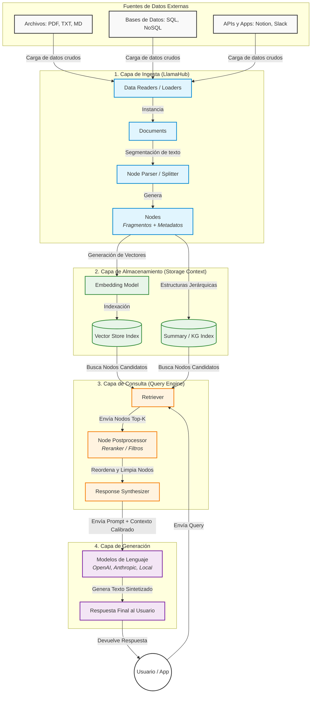

# RAG  (Retrieval-Augmented Generation)

RAG, que significa Retrieval-Augmented Generation (Generación Aumentada con Recuperación), es una técnica en inteligencia artificial que combina modelos de generación de texto (como los modelos de lenguaje) con sistemas de recuperación de información. Este enfoque permite que un modelo de lenguaje genere respuestas informadas y precisas utilizando fuentes de información externas.

RAG se utiliza mucho en aplicaciones como chatbots avanzados, asistentes virtuales, búsqueda de respuestas, y soporte técnico, ya que ayuda a que el modelo pueda responder preguntas complejas o específicas con información actualizada o de dominio específico.

# Conceptos

- Retrieval-Augmented Generation (RAG): Arquitectura que optimiza la salida de un LLM consultando una fuente de conocimiento externa antes de procesar la respuesta.
- Embeddings (Incrustaciones): Representaciones numéricas (vectores) de fragmentos de texto que capturan su significado semántico.
- Bases de Datos Vectoriales (Vector DBs): Sistemas de almacenamiento diseñados específicamente para realizar búsquedas rápidas basadas en la similitud del coseno o distancia euclidiana entre vectores.
- Chunking (Fragmentación): El proceso de dividir documentos largos en partes más pequeñas (chunks) manteniendo el contexto semántico. Un chunking deficiente arruina la precisión del RAG.
- Re-ranking (Re-clasificación): Paso posterior a la recuperación inicial donde un modelo secundario (Cross-Encoder) evalúa la relevancia exacta de los fragmentos recuperados para ordenar los mejores al principio

# Vector DB

- Qdrant
- Chroma
- Pinecone
- Supabase Vector / pgvector
- PostgreSQL + pgvector
- Weaviate

# Langflow

Langflow is a new, visual framework for building multi-agent and RAG applications. It is open-source, Python-powered, fully customizable, and LLM and vector store agnostic.

https://www.langflow.org/

Langflow es una herramienta de low-code / visual para construir aplicaciones de IA, especialmente orientada a flujos con modelos de lenguaje (LLMs), agentes multi-herramienta, RAG (Retrieval-Augmented Generation), bases de datos vectoriales, APIs, etc. 

Algunos puntos claves:

- Es open source / libre. Puedes instalarla tú mismo en tu máquina, servidor o en la nube. 
- Está basada en Python, y es agnóstica respecto a los modelos de lenguaje, APIs, bases de datos vectoriales, etc. Eso significa que puedes usar OpenAI, Hugging Face, modelos propios, etc. 
- Ofrece una interfaz visual (drag & drop) para diseñar flujos (“flows”): conectas nodos que hacen cosas como llamar a un LLM, recuperar documentos, consultar una base de datos, hacer cálculos, etc.  
- Tiene un “Playground” para probar los flujos en tiempo real, ver cómo responden los componentes, hacer debugging. 
- Permite desplegar tus flujos como APIs, exportarlos, reutilizarlos, formar agentes, usar memoria conversacional, integraciones con servicios externos. 
- Tiene también una versión en la nube (“Cloud Service”) facilitada por DataStax, que permite empezar sin necesidad de instalar. 
 
 
**Arquitectura**

- Python (basado en LangChain y FastAPI)

 
 
# Servicios, Productos, Librerias

## Llamaindex

Build AI Knowledge Assistants over your enterprise data
Build production agents that can find information, synthesize insights, generate reports, and take actions over the most complex enterprise data.

LlamaIndex es una poderosa herramienta para la indexación y recuperación de datos, diseñada para mejorar la accesibilidad a la información. Simplifica el proceso de indexar datos de manera eficiente, facilitando la localización y recuperación de información relevante. Al centrarse en la recuperación de datos, LlamaIndex garantiza que los usuarios puedan acceder rápidamente y de manera precisa a la información que necesitan. LlamaIndex es particularmente hábil en la indexación y almacenamiento de datos en incrustaciones, lo que mejora significativamente la relevancia y precisión de la recuperación de datos.

## LangChain

Es un framework para construir pipelines de IA:

- prompts
- chains
- tools
- agents

LangChain, por otro lado, ofrece funciones avanzadas de retención de contexto. Puede mantener el contexto durante interacciones prolongadas, lo que lo hace adecuado para aplicaciones que requieren conversaciones más largas y complejas, como chatbots. 

LangChain (MultiOn / Playwright Tool): LangChain tiene integraciones directas con herramientas de Playwright que permiten a un agente "ver" el DOM de una página y decidir qué campos llenar basándose en una descripción en lenguaje natural.

# Herramientas

Docling de IBM es una herramienta moderna de procesamiento inteligente de documentos con IA, diseñada principalmente para preparar información para sistemas de inteligencia artificial (como RAG o agentes IA).
